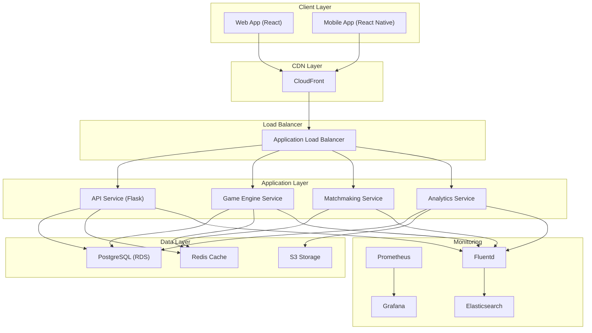

# DojoPool Architecture

## System Overview

DojoPool is built using a microservices architecture, with each component designed to be scalable and maintainable. The system is deployed on AWS using containerized services managed by ECS.

## Architecture Diagram



## Component Description

### Client Layer
- **Web Application**: React-based SPA providing the main user interface
- **Mobile Application**: React Native app for iOS and Android

### CDN Layer
- **CloudFront**: Distributes static content and provides DDoS protection

### Load Balancer
- **Application Load Balancer**: Routes traffic to appropriate services

### Application Layer
- **API Service**: Main application backend handling user requests
- **Game Engine**: Processes game logic and real-time updates
- **Matchmaker**: Handles player matchmaking and game session creation
- **Analytics**: Processes game data and generates insights

### Data Layer
- **PostgreSQL**: Primary database for user and game data
- **Redis**: Caching and real-time data storage
- **S3**: Object storage for media and backups

### Monitoring Stack
- **Prometheus**: Metrics collection and alerting
- **Grafana**: Metrics visualization and dashboards
- **Fluentd**: Log aggregation
- **Elasticsearch**: Log storage and search

## Security Measures

1. **Network Security**
   - VPC with public and private subnets
   - Security groups and NACLs
   - WAF for web application protection

2. **Application Security**
   - JWT-based authentication
   - Rate limiting
   - Input validation
   - HTTPS everywhere

3. **Data Security**
   - Encryption at rest
   - Encryption in transit
   - Regular backups
   - Access control policies

## Scalability

The system is designed to scale horizontally:

1. **Application Layer**
   - Auto-scaling groups for all services
   - Container-based deployment
   - Stateless application design

2. **Data Layer**
   - Read replicas for PostgreSQL
   - Redis cluster for caching
   - S3 for static content

3. **CDN**
   - Global edge locations
   - Cache optimization
   - Dynamic content acceleration

## Monitoring and Observability

1. **Metrics**
   - Application metrics
   - Infrastructure metrics
   - Business metrics
   - Custom game metrics

2. **Logging**
   - Centralized logging
   - Log retention policies
   - Log-based alerts

3. **Alerting**
   - Service health alerts
   - Performance alerts
   - Security alerts
   - Business metric alerts

## Deployment Strategy

1. **CI/CD Pipeline**
   - Automated testing
   - Staging environment
   - Blue-green deployments
   - Rollback capabilities

2. **Infrastructure as Code**
   - Terraform for infrastructure
   - Docker for containers
   - Configuration management

3. **Environment Management**
   - Development
   - Staging
   - Production
   - Disaster recovery
``` 