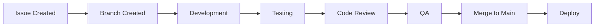

# Development Workflow

This guide outlines our development process from start to finish, ensuring consistent and high-quality code delivery.

## Development Lifecycle



## 1. Getting Started

### Initial Setup

```bash
# Clone the repository
git clone https://github.com/your-org/dojo-pool
cd dojo-pool

# Install dependencies
npm install

# Set up pre-commit hooks
npm run prepare

# Start development server
npm run dev
```

### Environment Configuration

1. Copy the example environment file:
```bash
cp .env.example .env
```

2. Update the variables:
```env
NODE_ENV=development
API_URL=http://localhost:3000
DATABASE_URL=postgresql://localhost:5432/dojo_pool
```

## 2. Feature Development

### Branch Strategy

```bash
# Feature branches
feature/add-user-authentication

# Bug fixes
fix/login-validation-error

# Documentation
docs/api-documentation

# Performance improvements
perf/optimize-database-queries
```

### Development Process

1. **Create Feature Branch**
```bash
git checkout -b feature/your-feature-name
```

2. **Make Changes**
- Follow [coding standards](coding-standards.md)
- Write tests
- Update documentation

3. **Commit Changes**
```bash
# Stage changes
git add .

# Commit with conventional commit message
git commit -m "feat(auth): add OAuth2 authentication"
```

4. **Push Changes**
```bash
git push origin feature/your-feature-name
```

## 3. Quality Assurance

### Code Quality Checks

```bash
# Run linting
npm run lint

# Run type checking
npm run type-check

# Run tests
npm run test

# Run all checks
npm run validate
```

### Testing Requirements

1. **Unit Tests**
```typescript
describe('UserService', () => {
  it('should create user with valid data', async () => {
    const service = new UserService(mockDb);
    const user = await service.createUser(validUserData);
    expect(user).toBeDefined();
  });
});
```

2. **Integration Tests**
```typescript
describe('Authentication API', () => {
  it('should authenticate valid user', async () => {
    const response = await request(app)
      .post('/api/auth/login')
      .send(validCredentials);
    
    expect(response.status).toBe(200);
    expect(response.body.token).toBeDefined();
  });
});
```

### Performance Testing

```bash
# Run performance tests
npm run test:perf

# Run load tests
npm run test:load
```

## 4. Code Review Process

### Pull Request Template

```markdown
## Description
Brief description of changes

## Type of Change
- [ ] Bug fix
- [ ] New feature
- [ ] Breaking change
- [ ] Documentation update

## Testing
- [ ] Unit tests added/updated
- [ ] Integration tests added/updated
- [ ] Manual testing performed

## Checklist
- [ ] Code follows style guidelines
- [ ] Tests passing
- [ ] Documentation updated
- [ ] No new warnings
```

### Review Guidelines

1. **Code Quality**
   - Follows coding standards
   - No code smells
   - Proper error handling

2. **Testing**
   - Adequate test coverage
   - Edge cases covered
   - Tests are meaningful

3. **Documentation**
   - Code is self-documenting
   - Comments where necessary
   - Documentation updated

## 5. Deployment Process

### Staging Deployment

```bash
# Deploy to staging
npm run deploy:staging

# Run smoke tests
npm run test:smoke

# Monitor for issues
npm run monitor:staging
```

### Production Deployment

```bash
# Create release branch
git checkout -b release/v1.0.0

# Run release checks
npm run pre-release

# Deploy to production
npm run deploy:prod

# Tag release
git tag -a v1.0.0 -m "Release v1.0.0"
```

## 6. Monitoring and Maintenance

### Health Checks

```typescript
// health-check.ts
async function performHealthCheck(): Promise<HealthStatus> {
  return {
    database: await checkDatabaseConnection(),
    cache: await checkRedisConnection(),
    api: await checkExternalAPIs(),
    queue: await checkMessageQueue()
  };
}
```

### Error Tracking

```typescript
// error-tracking.ts
function trackError(error: Error): void {
  logger.error({
    message: error.message,
    stack: error.stack,
    timestamp: new Date(),
    environment: process.env.NODE_ENV
  });
}
```

## 7. Best Practices

### 1. Version Control

- Keep commits focused and atomic
- Write meaningful commit messages
- Rebase feature branches regularly
- Delete merged branches

### 2. Code Organization

- Follow project structure
- Keep components small and focused
- Use meaningful file names
- Maintain clear dependencies

### 3. Testing Strategy

- Write tests before code (TDD)
- Maintain high test coverage
- Use meaningful test descriptions
- Test edge cases thoroughly

### 4. Documentation

- Document as you code
- Keep README updated
- Document API changes
- Update changelog

### 5. Performance

- Optimize database queries
- Use caching effectively
- Minimize bundle size
- Monitor performance metrics

## 8. Troubleshooting

### Common Issues

1. **Build Failures**
```bash
# Clear cache and node_modules
rm -rf node_modules
rm -rf .cache
npm install
```

2. **Database Issues**
```bash
# Reset database
npm run db:reset

# Run migrations
npm run db:migrate
```

3. **Test Failures**
```bash
# Update test snapshots
npm run test:update

# Clear test cache
npm run test:clear-cache
```

## 9. Support and Resources

### Getting Help

1. Check documentation
2. Search existing issues
3. Ask in team chat
4. Create support ticket

### Useful Commands

```bash
# Development
npm run dev          # Start development server
npm run build       # Build for production
npm run test        # Run tests
npm run lint        # Run linting

# Database
npm run db:migrate  # Run migrations
npm run db:seed     # Seed database
npm run db:reset    # Reset database

# Deployment
npm run deploy:staging  # Deploy to staging
npm run deploy:prod    # Deploy to production
```

## 10. Continuous Improvement

### Feedback Loop

1. Collect metrics
2. Analyze bottlenecks
3. Implement improvements
4. Monitor results

### Regular Reviews

- Code quality metrics
- Performance metrics
- Security audits
- Documentation updates 